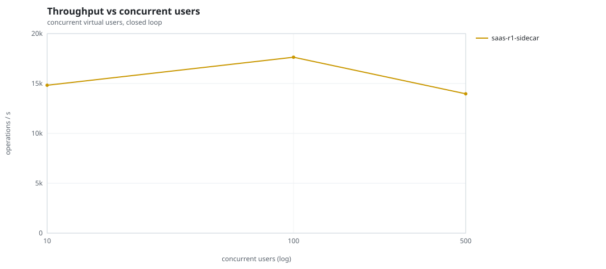
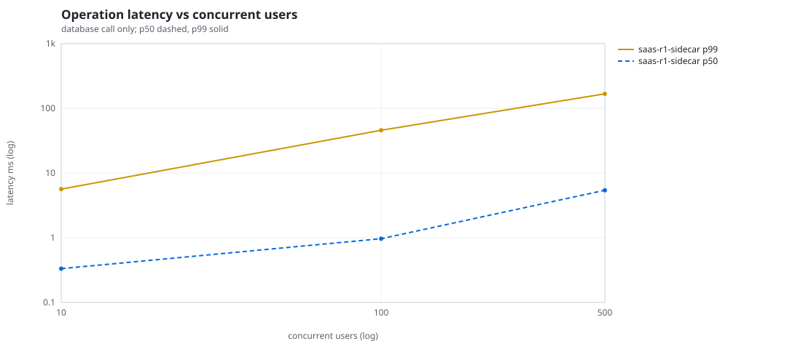
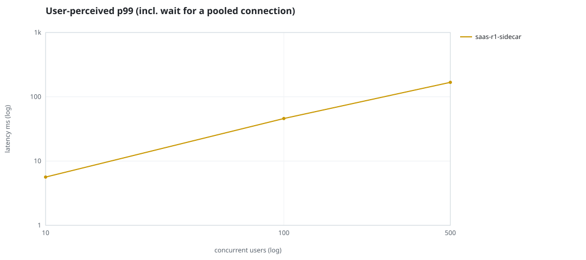
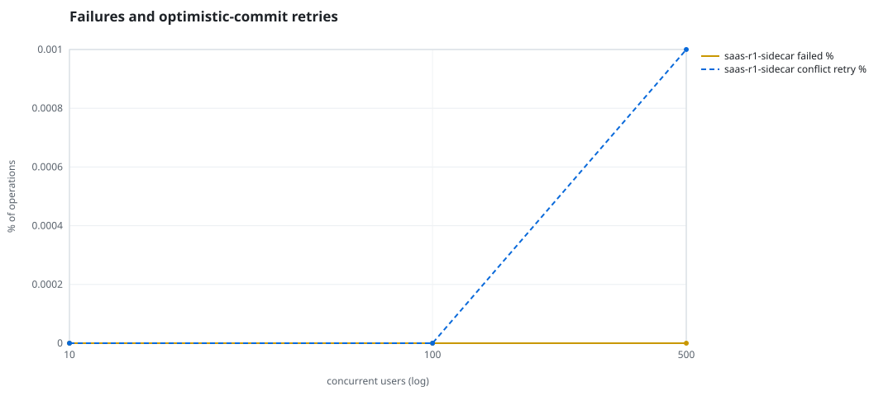
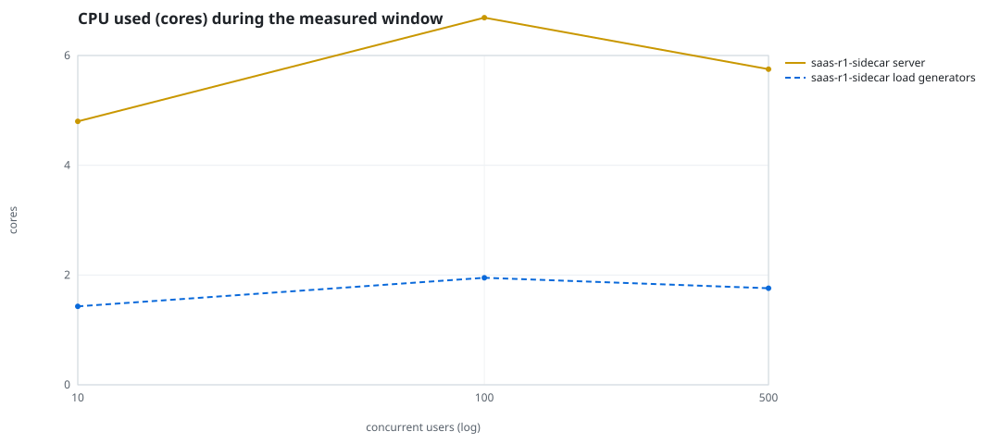
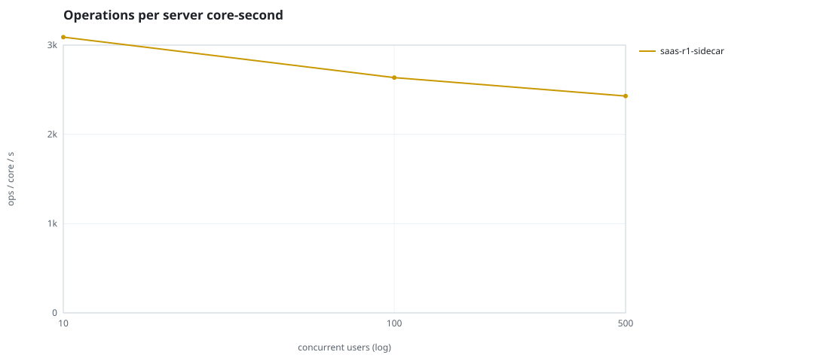
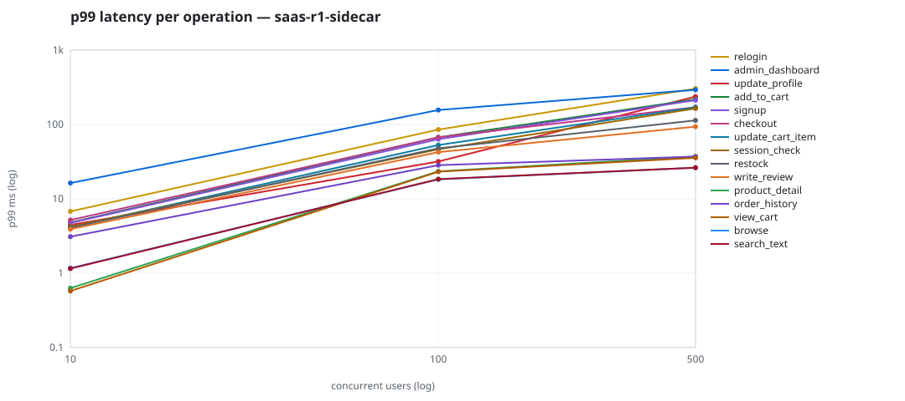

# Mini-SaaS concurrency simulation — sidecar

Run: `saas-r1-sidecar` on 2026-09-26T05:30:51 · commit `5ff1190` · macOS-26.6.2-arm64-arm-64bit-Mach-O · 10 CPUs

## Configuration

- **transport**: sidecar
- **levels**: [10, 100, 500]
- **duration**: 30.0
- **warmup**: 5.0
- **ramp**: 5.0
- **think**: [0.0, 0.0]
- **processes**: 10
- **connections**: 0
- **durability**: balanced
- **products**: 5000
- **accounts**: 20000
- **scenario**: baseline
- **seed**: 1
- **fresh_per_stage**: False
- **seed time**: 1.09 s, 12.9 MiB after seeding

## Capacity and performance curve

Latencies are of the database call (service operation) in milliseconds; `user p99` adds the wait for a pooled connection.

| users | conns | ops/s | reads/s | writes/s | p50 | p95 | p99 | p99.9 | max | user p99 | success % | conflict retry % | srv CPU | srv RSS MiB | gen CPU | thr CV | invariants |
|---:|---:|---:|---:|---:|---:|---:|---:|---:|---:|---:|---:|---:|---:|---:|---:|---:|---:|
| 10 | 10 | 14828.6 | 11214.4 | 3614.2 | 0.333 | 1.909 | 5.638 | 12.203 | 1835.699 | 5.639 | 100.0 | 0.0 | 4.8 | 301.1 | 1.43 | 0.334 | ok |
| 100 | 100 | 17633.0 | 13330.7 | 4302.3 | 0.967 | 21.47 | 45.855 | 106.985 | 1944.488 | 45.856 | 100.0 | 0.0 | 6.69 | 400.7 | 1.95 | 0.127 | ok |
| 500 | 500 | 13968.1 | 10563.5 | 3404.6 | 5.415 | 111.947 | 167.87 | 3601.441 | 3724.141 | 167.871 | 100.0 | 0.001 | 5.75 | 586.6 | 1.76 | 0.403 | ok |

## Insights

- **Peak throughput**: 17633.0 ops/s at 100 users (p99 45.855 ms).
- **Capacity at p99 ≤ 10 ms**: 10 users (DB latency); 10 users counting pool wait.
- **Capacity at p99 ≤ 50 ms**: 100 users (DB latency); 100 users counting pool wait.
- **Capacity at p99 ≤ 100 ms**: 100 users (DB latency); 100 users counting pool wait.
- **Capacity at p99 ≤ 250 ms**: 500 users (DB latency); 500 users counting pool wait.
- **Capacity at p99 ≤ 1000 ms**: 500 users (DB latency); 500 users counting pool wait.
- **USL fit**: σ (contention) = 0.22, κ (coherency) = 2.00e-04, predicted peak at N ≈ 62.5 (rmse log 0.0119).
- **Ops per server core-second**: 10→3089, 100→2636, 500→2429.
- **Seconds with zero completed operations** (stalls): [(10, 1), (500, 3)].
- **Read-your-writes violations**: none.
- **Business invariants**: all stages ok.
- **Offline integrity check** (elitesql check): ok in 26.99 s.
  - right after killing the server (no clean close): exit 3, 0 errors, 961198 warnings; after one clean open/close: exit 0, 0 errors, 0 warnings.
- **Database size**: 54.6 MiB after the first stage, 139.7 MiB after the last; 59675 paid orders in total.

## p99 latency per operation (ms)

| op | share % | 10 | 100 | 500 |
|---|---:|---:|---:|---:|
| add_to_cart | 10.89 | 4.80 | 67.08 | 217.60 |
| admin_dashboard | 1.11 | 16.30 | 156.35 | 292.91 |
| browse | 21.9 | 1.17 | 18.28 | 26.23 |
| checkout | 4.37 | 5.18 | 67.31 | 170.89 |
| order_history | 3.34 | 3.10 | 28.39 | 37.00 |
| product_detail | 18.62 | 0.63 | 23.42 | 37.09 |
| relogin | 1.65 | 6.78 | 85.30 | 303.24 |
| restock | 0.33 | 4.09 | 47.82 | 113.58 |
| search_text | 8.84 | 1.15 | 18.43 | 26.22 |
| session_check | 13.09 | 4.22 | 46.37 | 164.32 |
| signup | 0.54 | 4.73 | 63.38 | 212.22 |
| update_cart_item | 3.28 | 4.15 | 52.98 | 170.34 |
| update_profile | 1.1 | 4.46 | 31.75 | 237.50 |
| view_cart | 8.72 | 0.58 | 23.17 | 35.58 |
| write_review | 2.2 | 3.90 | 42.52 | 93.48 |

## Errors and business outcomes at the highest level

```json
{
 "statuses": {
  "ok": 412940,
  "out_of_stock": 888,
  "empty_cart": 5172,
  "not_found": 43
 },
 "errors": {}
}
```

## Charts








