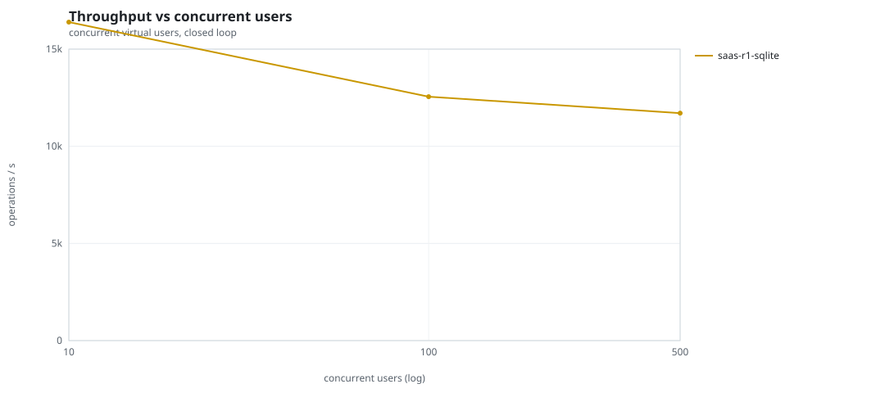
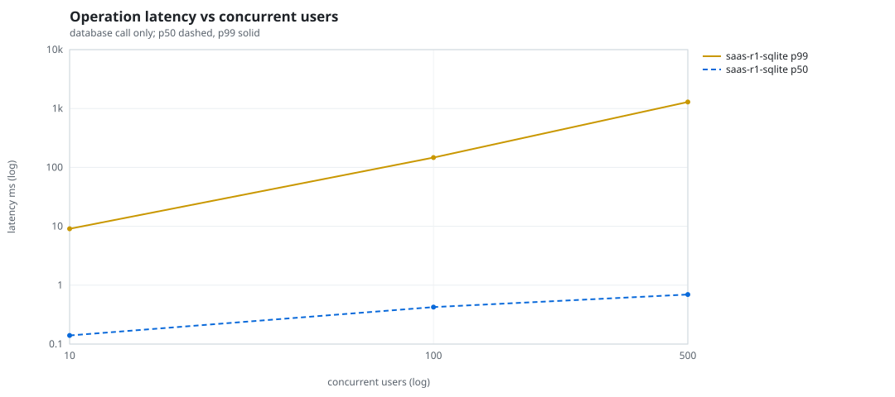
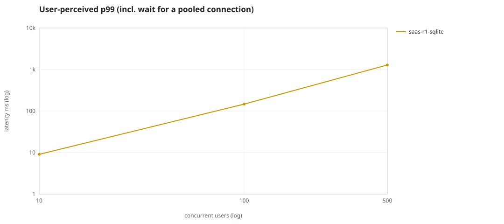
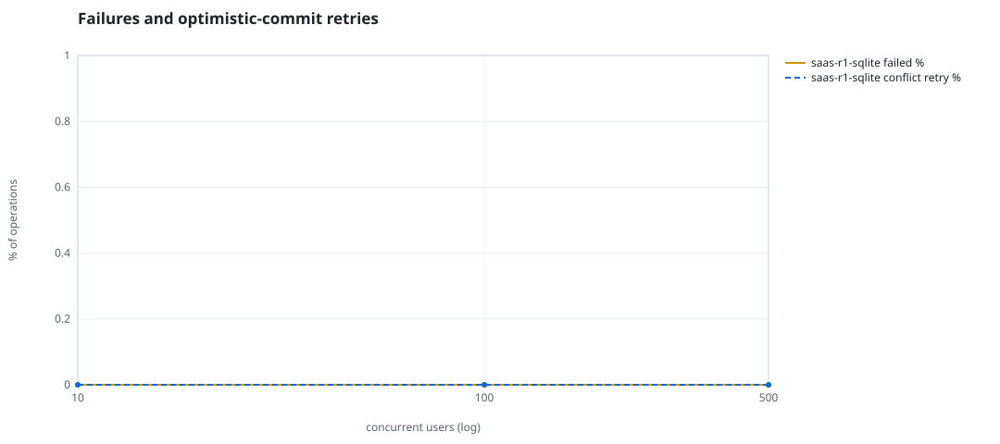
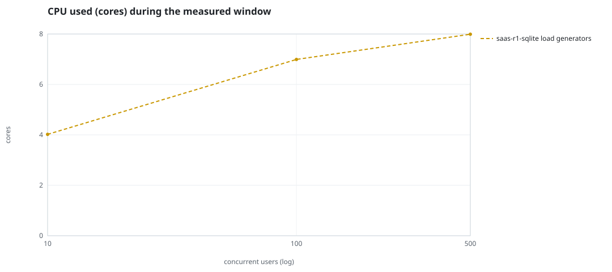
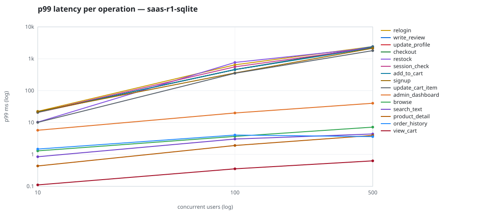

# Mini-SaaS concurrency simulation — sqlite

Run: `saas-r1-sqlite` on 2026-09-26T05:33:45 · commit `5ff1190` · macOS-26.6.2-arm64-arm-64bit-Mach-O · 10 CPUs

## Configuration

- **transport**: sqlite
- **levels**: [10, 100, 500]
- **duration**: 30.0
- **warmup**: 5.0
- **ramp**: 5.0
- **think**: [0.0, 0.0]
- **processes**: 10
- **connections**: 0
- **durability**: balanced
- **products**: 5000
- **accounts**: 20000
- **scenario**: baseline
- **seed**: 1
- **fresh_per_stage**: False
- **seed time**: 0.11 s, 4.6 MiB after seeding

## Capacity and performance curve

Latencies are of the database call (service operation) in milliseconds; `user p99` adds the wait for a pooled connection.

| users | conns | ops/s | reads/s | writes/s | p50 | p95 | p99 | p99.9 | max | user p99 | success % | conflict retry % | srv CPU | srv RSS MiB | gen CPU | thr CV | invariants |
|---:|---:|---:|---:|---:|---:|---:|---:|---:|---:|---:|---:|---:|---:|---:|---:|---:|---:|
| 10 | 10 | 16390.1 | 12388.0 | 4002.1 | 0.14 | 1.463 | 9.081 | 41.373 | 759.393 | 9.081 | 100.0 | 0.0 | None | None | 4.02 | 0.058 | ok |
| 100 | 100 | 12550.3 | 9489.5 | 3060.8 | 0.424 | 10.231 | 147.088 | 1083.873 | 3856.576 | 147.089 | 100.0 | 0.0 | None | None | 6.99 | 0.044 | ok |
| 500 | 500 | 11706.1 | 8855.1 | 2851.0 | 0.693 | 90.637 | 1289.306 | 3448.291 | 11197.28 | 1289.307 | 100.0 | 0.0 | None | None | 7.99 | 0.041 | ok |

## Insights

- **Peak throughput**: 16390.1 ops/s at 10 users (p99 9.081 ms).
- **Capacity at p99 ≤ 10 ms**: 10 users (DB latency); 10 users counting pool wait.
- **Capacity at p99 ≤ 50 ms**: 10 users (DB latency); 10 users counting pool wait.
- **Capacity at p99 ≤ 100 ms**: 10 users (DB latency); 10 users counting pool wait.
- **Capacity at p99 ≤ 250 ms**: 100 users (DB latency); 100 users counting pool wait.
- **Capacity at p99 ≤ 1000 ms**: 100 users (DB latency); 100 users counting pool wait.
- **USL fit**: σ (contention) = 0.29, κ (coherency) = 3.16e-04, predicted peak at N ≈ 47.4 (rmse log 0.1559).
- **Generator CPU includes the database**: SQLite runs inside the load-generator processes, so `gen CPU` is application plus engine and there is no server column.
- **Read-your-writes violations**: none.
- **Business invariants**: all stages ok.
- **Offline integrity check** (PRAGMA integrity_check): ok in 0.09 s.
- **Database size**: 11.6 MiB after the first stage, 22.4 MiB after the last; 52311 paid orders in total.

## p99 latency per operation (ms)

| op | share % | 10 | 100 | 500 |
|---|---:|---:|---:|---:|
| add_to_cart | 10.91 | 21.19 | 457.42 | 2208.93 |
| admin_dashboard | 1.11 | 5.74 | 19.98 | 40.24 |
| browse | 21.91 | 1.29 | 3.68 | 7.19 |
| checkout | 4.4 | 21.22 | 457.42 | 2304.48 |
| order_history | 3.34 | 1.48 | 4.05 | 3.62 |
| product_detail | 18.61 | 0.44 | 1.91 | 3.96 |
| relogin | 1.65 | 22.41 | 646.56 | 2416.89 |
| restock | 0.33 | 10.30 | 768.01 | 2223.48 |
| search_text | 8.8 | 0.85 | 3.04 | 4.38 |
| session_check | 13.09 | 21.22 | 558.83 | 2213.30 |
| signup | 0.54 | 22.09 | 358.84 | 2136.31 |
| update_cart_item | 3.3 | 10.13 | 350.56 | 1804.24 |
| update_profile | 1.09 | 20.67 | 456.68 | 2321.11 |
| view_cart | 8.73 | 0.11 | 0.35 | 0.63 |
| write_review | 2.19 | 21.39 | 460.85 | 2409.83 |

## Errors and business outcomes at the highest level

```json
{
 "statuses": {
  "ok": 346164,
  "empty_cart": 4539,
  "not_found": 39,
  "out_of_stock": 441
 },
 "errors": {}
}
```

## Charts








