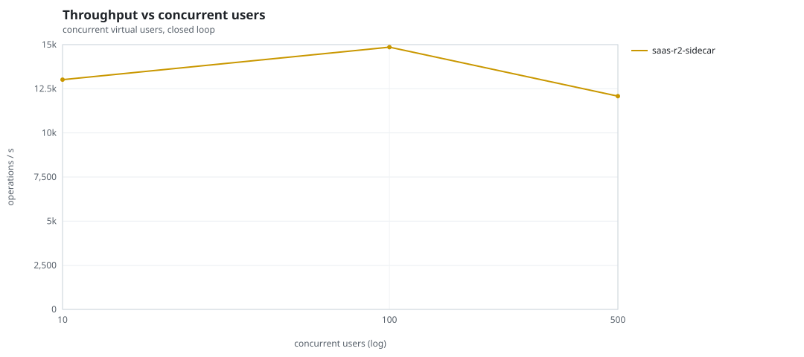
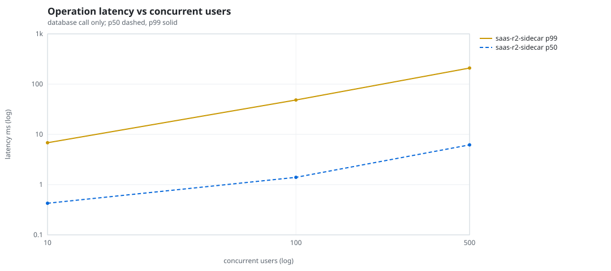
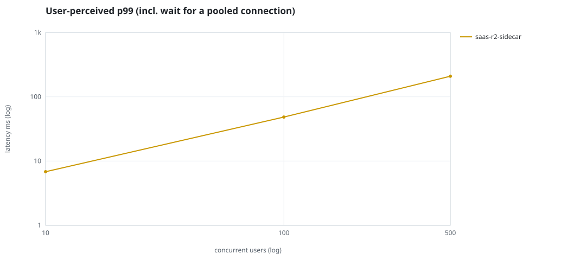
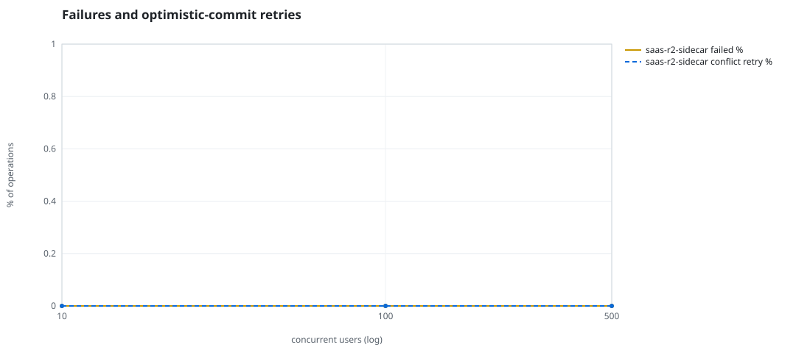
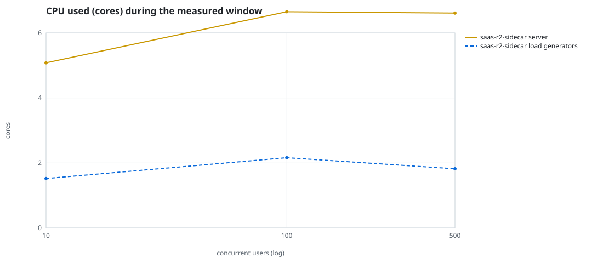
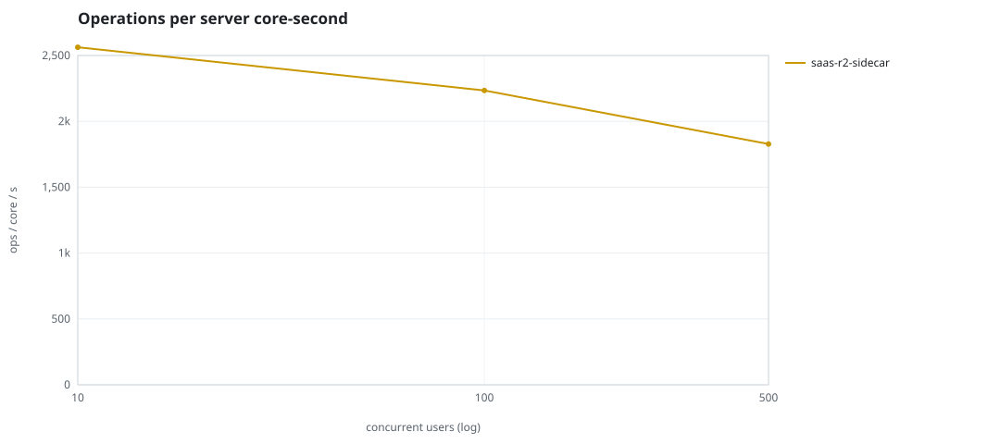
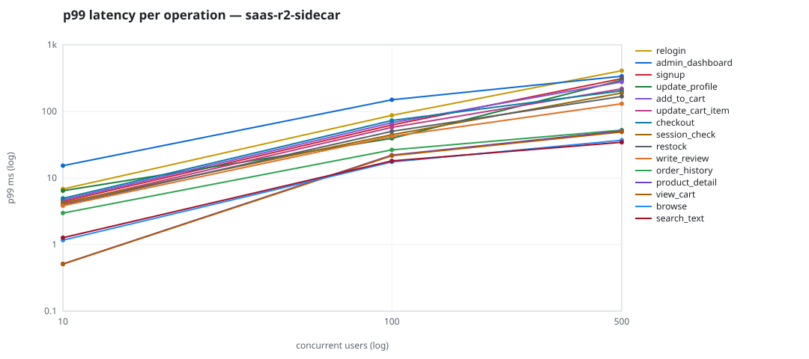

# Mini-SaaS concurrency simulation — sidecar

Run: `saas-r2-sidecar` on 2026-09-26T05:38:20 · commit `5ff1190` · macOS-26.6.2-arm64-arm-64bit-Mach-O · 10 CPUs

## Configuration

- **transport**: sidecar
- **levels**: [10, 100, 500]
- **duration**: 30.0
- **warmup**: 5.0
- **ramp**: 5.0
- **think**: [0.0, 0.0]
- **processes**: 10
- **connections**: 0
- **durability**: balanced
- **products**: 5000
- **accounts**: 20000
- **scenario**: baseline
- **seed**: 2
- **fresh_per_stage**: False
- **seed time**: 1.09 s, 12.9 MiB after seeding

## Capacity and performance curve

Latencies are of the database call (service operation) in milliseconds; `user p99` adds the wait for a pooled connection.

| users | conns | ops/s | reads/s | writes/s | p50 | p95 | p99 | p99.9 | max | user p99 | success % | conflict retry % | srv CPU | srv RSS MiB | gen CPU | thr CV | invariants |
|---:|---:|---:|---:|---:|---:|---:|---:|---:|---:|---:|---:|---:|---:|---:|---:|---:|---:|
| 10 | 10 | 13017.5 | 9833.6 | 3183.9 | 0.426 | 2.043 | 6.824 | 12.787 | 1800.312 | 6.825 | 100.0 | 0.0 | 5.08 | 309.9 | 1.52 | 0.185 | ok |
| 100 | 100 | 14858.2 | 11218.2 | 3640.0 | 1.397 | 24.478 | 48.373 | 98.211 | 1899.478 | 48.373 | 100.0 | 0.0 | 6.65 | 369.4 | 2.16 | 0.085 | ok |
| 500 | 500 | 12081.0 | 9120.3 | 2960.7 | 6.182 | 132.619 | 208.81 | 3583.124 | 4286.196 | 208.811 | 100.0 | 0.0 | 6.61 | 613.6 | 1.82 | 0.294 | ok |

## Insights

- **Peak throughput**: 14858.2 ops/s at 100 users (p99 48.373 ms).
- **Capacity at p99 ≤ 10 ms**: 10 users (DB latency); 10 users counting pool wait.
- **Capacity at p99 ≤ 50 ms**: 100 users (DB latency); 100 users counting pool wait.
- **Capacity at p99 ≤ 100 ms**: 100 users (DB latency); 100 users counting pool wait.
- **Capacity at p99 ≤ 250 ms**: 500 users (DB latency); 500 users counting pool wait.
- **Capacity at p99 ≤ 1000 ms**: 500 users (DB latency); 500 users counting pool wait.
- **USL fit**: σ (contention) = 0.23, κ (coherency) = 2.00e-04, predicted peak at N ≈ 62.1 (rmse log 0.0248).
- **Ops per server core-second**: 10→2562, 100→2234, 500→1828.
- **Seconds with zero completed operations** (stalls): [(500, 2)].
- **Read-your-writes violations**: none.
- **Business invariants**: all stages ok.
- **Offline integrity check** (elitesql check): ok in 20.47 s.
  - right after killing the server (no clean close): exit 3, 0 errors, 843042 warnings; after one clean open/close: exit 0, 0 errors, 0 warnings.
- **Database size**: 39.6 MiB after the first stage, 97.5 MiB after the last; 52076 paid orders in total.

## p99 latency per operation (ms)

| op | share % | 10 | 100 | 500 |
|---|---:|---:|---:|---:|
| add_to_cart | 10.92 | 4.68 | 67.70 | 278.09 |
| admin_dashboard | 1.07 | 15.32 | 149.67 | 338.16 |
| browse | 21.95 | 1.17 | 17.45 | 36.96 |
| checkout | 4.38 | 4.95 | 73.19 | 204.08 |
| order_history | 3.3 | 2.97 | 26.46 | 52.52 |
| product_detail | 18.59 | 0.51 | 22.08 | 51.06 |
| relogin | 1.63 | 6.84 | 87.37 | 409.75 |
| restock | 0.32 | 3.92 | 50.29 | 168.20 |
| search_text | 8.74 | 1.27 | 18.09 | 34.41 |
| session_check | 13.18 | 4.25 | 44.71 | 189.27 |
| signup | 0.55 | 4.45 | 62.59 | 311.51 |
| update_cart_item | 3.33 | 4.12 | 57.60 | 218.78 |
| update_profile | 1.1 | 6.44 | 39.42 | 295.09 |
| view_cart | 8.72 | 0.51 | 21.60 | 49.24 |
| write_review | 2.23 | 3.84 | 42.24 | 130.39 |

## Errors and business outcomes at the highest level

```json
{
 "statuses": {
  "ok": 357332,
  "empty_cart": 4590,
  "out_of_stock": 479,
  "not_found": 28
 },
 "errors": {}
}
```

## Charts








