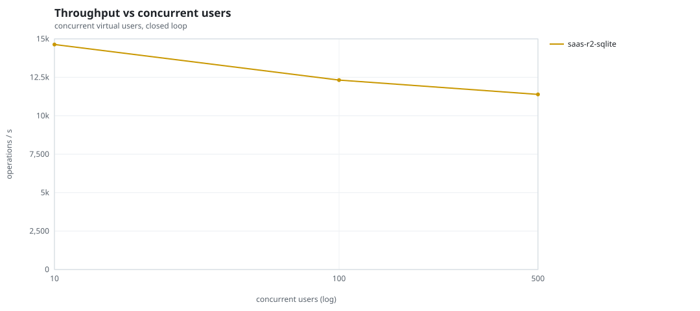
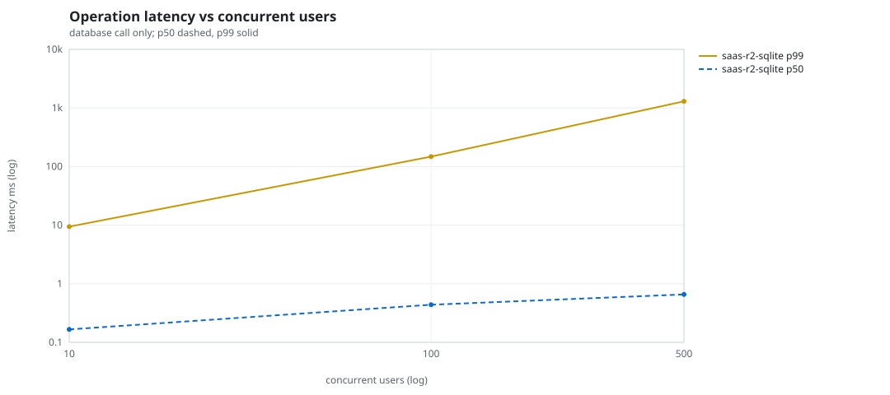
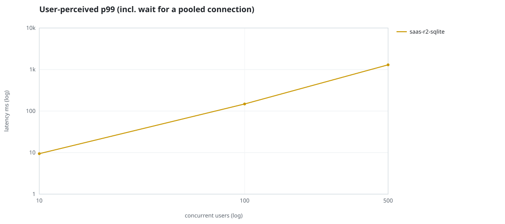
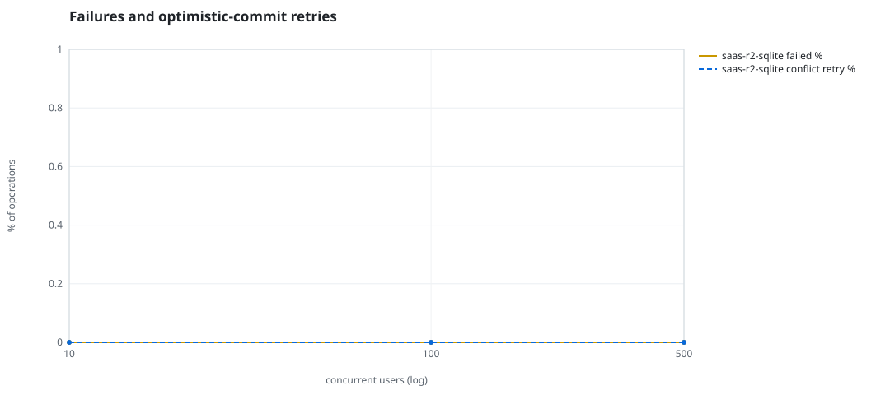
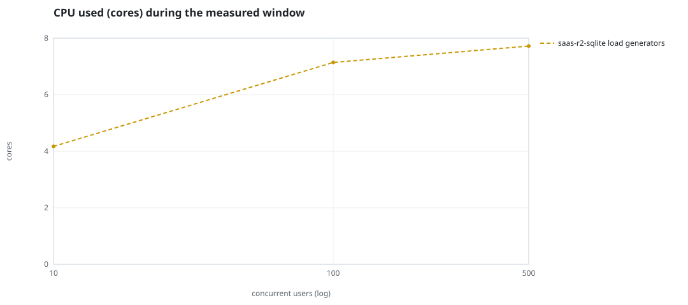
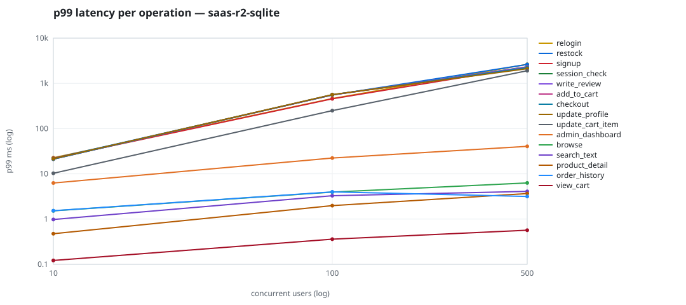

# Mini-SaaS concurrency simulation — sqlite

Run: `saas-r2-sqlite` on 2026-09-26T05:36:02 · commit `5ff1190` · macOS-26.6.2-arm64-arm-64bit-Mach-O · 10 CPUs

## Configuration

- **transport**: sqlite
- **levels**: [10, 100, 500]
- **duration**: 30.0
- **warmup**: 5.0
- **ramp**: 5.0
- **think**: [0.0, 0.0]
- **processes**: 10
- **connections**: 0
- **durability**: balanced
- **products**: 5000
- **accounts**: 20000
- **scenario**: baseline
- **seed**: 2
- **fresh_per_stage**: False
- **seed time**: 0.12 s, 4.6 MiB after seeding

## Capacity and performance curve

Latencies are of the database call (service operation) in milliseconds; `user p99` adds the wait for a pooled connection.

| users | conns | ops/s | reads/s | writes/s | p50 | p95 | p99 | p99.9 | max | user p99 | success % | conflict retry % | srv CPU | srv RSS MiB | gen CPU | thr CV | invariants |
|---:|---:|---:|---:|---:|---:|---:|---:|---:|---:|---:|---:|---:|---:|---:|---:|---:|---:|
| 10 | 10 | 14634.9 | 11056.7 | 3578.1 | 0.166 | 1.533 | 9.425 | 41.755 | 978.986 | 9.425 | 100.0 | 0.0 | None | None | 4.17 | 0.066 | ok |
| 100 | 100 | 12320.1 | 9296.1 | 3023.9 | 0.439 | 10.295 | 148.058 | 1075.395 | 3448.781 | 148.059 | 100.0 | 0.0 | None | None | 7.14 | 0.016 | ok |
| 500 | 500 | 11390.4 | 8610.2 | 2780.2 | 0.656 | 90.537 | 1299.358 | 3556.11 | 8174.434 | 1299.359 | 100.0 | 0.0 | None | None | 7.72 | 0.023 | ok |

## Insights

- **Peak throughput**: 14634.9 ops/s at 10 users (p99 9.425 ms).
- **Capacity at p99 ≤ 10 ms**: 10 users (DB latency); 10 users counting pool wait.
- **Capacity at p99 ≤ 50 ms**: 10 users (DB latency); 10 users counting pool wait.
- **Capacity at p99 ≤ 100 ms**: 10 users (DB latency); 10 users counting pool wait.
- **Capacity at p99 ≤ 250 ms**: 100 users (DB latency); 100 users counting pool wait.
- **Capacity at p99 ≤ 1000 ms**: 100 users (DB latency); 100 users counting pool wait.
- **USL fit**: σ (contention) = 0.27, κ (coherency) = 2.51e-04, predicted peak at N ≈ 53.9 (rmse log 0.1262).
- **Generator CPU includes the database**: SQLite runs inside the load-generator processes, so `gen CPU` is application plus engine and there is no server column.
- **Read-your-writes violations**: none.
- **Business invariants**: all stages ok.
- **Offline integrity check** (PRAGMA integrity_check): ok in 0.09 s.
- **Database size**: 11.0 MiB after the first stage, 21.6 MiB after the last; 49878 paid orders in total.

## p99 latency per operation (ms)

| op | share % | 10 | 100 | 500 |
|---|---:|---:|---:|---:|
| add_to_cart | 10.91 | 21.16 | 554.98 | 2217.84 |
| admin_dashboard | 1.07 | 6.28 | 22.38 | 40.53 |
| browse | 21.91 | 1.52 | 3.96 | 6.30 |
| checkout | 4.4 | 21.16 | 560.77 | 2216.42 |
| order_history | 3.31 | 1.53 | 3.99 | 3.16 |
| product_detail | 18.63 | 0.48 | 1.98 | 3.67 |
| relogin | 1.63 | 22.74 | 462.18 | 2635.01 |
| restock | 0.33 | 22.08 | 553.00 | 2622.64 |
| search_text | 8.74 | 0.98 | 3.29 | 4.09 |
| session_check | 13.16 | 21.58 | 556.34 | 2321.23 |
| signup | 0.55 | 22.07 | 456.22 | 2325.01 |
| update_cart_item | 3.31 | 10.30 | 250.06 | 1901.75 |
| update_profile | 1.1 | 21.57 | 564.26 | 2113.03 |
| view_cart | 8.73 | 0.12 | 0.36 | 0.57 |
| write_review | 2.22 | 21.26 | 561.02 | 2310.75 |

## Errors and business outcomes at the highest level

```json
{
 "statuses": {
  "ok": 337017,
  "empty_cart": 4295,
  "out_of_stock": 380,
  "not_found": 20
 },
 "errors": {}
}
```

## Charts








