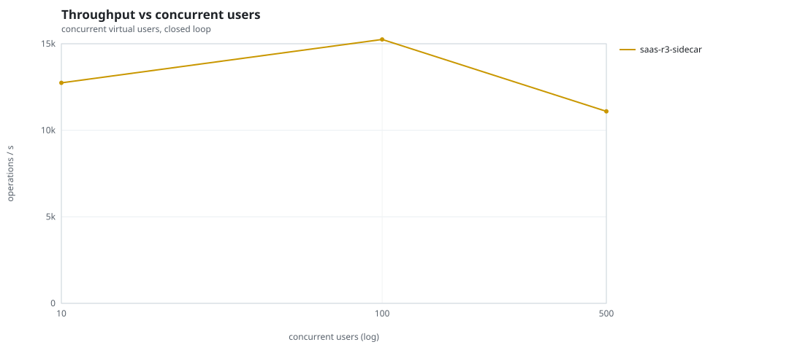
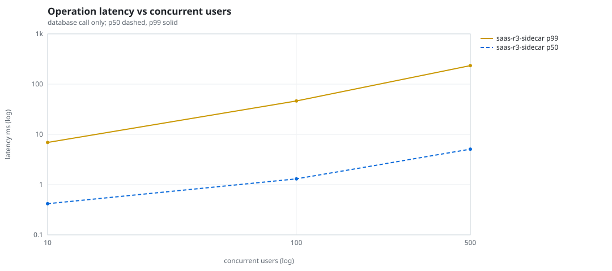
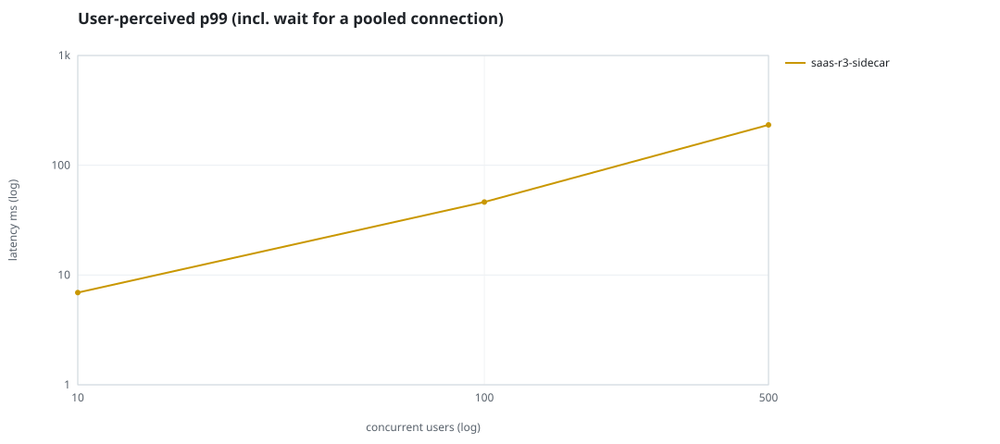
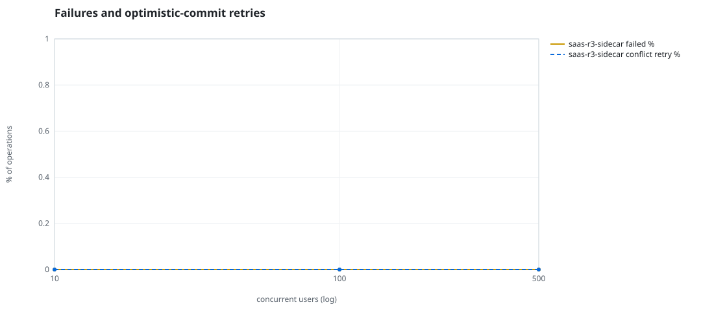
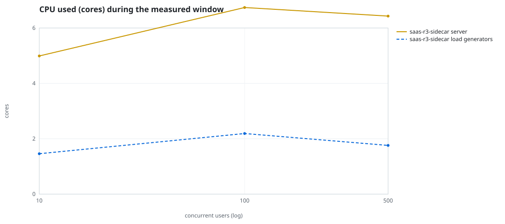
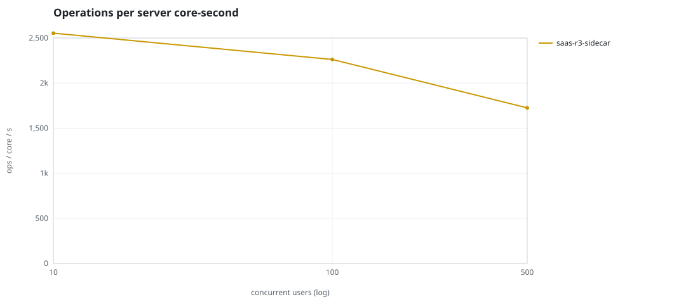
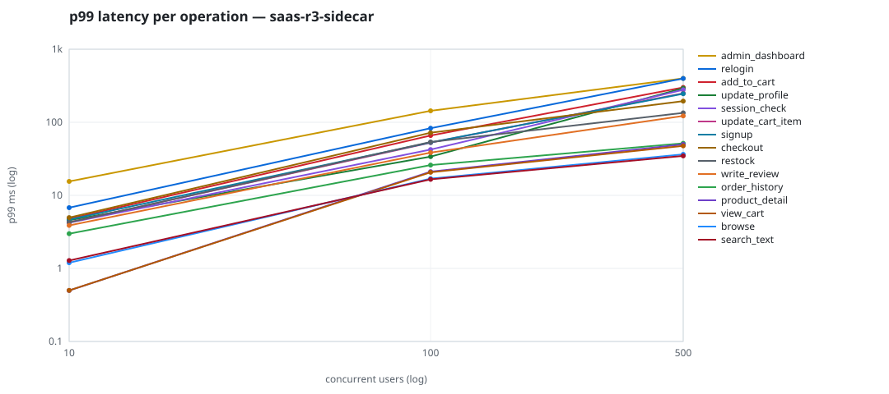

# Mini-SaaS concurrency simulation — sidecar

Run: `saas-r3-sidecar` on 2026-09-26T05:41:07 · commit `5ff1190` · macOS-26.6.2-arm64-arm-64bit-Mach-O · 10 CPUs

## Configuration

- **transport**: sidecar
- **levels**: [10, 100, 500]
- **duration**: 30.0
- **warmup**: 5.0
- **ramp**: 5.0
- **think**: [0.0, 0.0]
- **processes**: 10
- **connections**: 0
- **durability**: balanced
- **products**: 5000
- **accounts**: 20000
- **scenario**: baseline
- **seed**: 3
- **fresh_per_stage**: False
- **seed time**: 1.09 s, 12.9 MiB after seeding

## Capacity and performance curve

Latencies are of the database call (service operation) in milliseconds; `user p99` adds the wait for a pooled connection.

| users | conns | ops/s | reads/s | writes/s | p50 | p95 | p99 | p99.9 | max | user p99 | success % | conflict retry % | srv CPU | srv RSS MiB | gen CPU | thr CV | invariants |
|---:|---:|---:|---:|---:|---:|---:|---:|---:|---:|---:|---:|---:|---:|---:|---:|---:|---:|
| 10 | 10 | 12742.2 | 9624.5 | 3117.7 | 0.417 | 2.085 | 6.915 | 12.837 | 1745.834 | 6.916 | 100.0 | 0.0 | 4.99 | 315.6 | 1.46 | 0.282 | ok |
| 100 | 100 | 15247.5 | 11507.5 | 3740.1 | 1.302 | 23.705 | 46.234 | 97.665 | 1888.025 | 46.235 | 100.0 | 0.0 | 6.74 | 407.5 | 2.19 | 0.072 | ok |
| 500 | 500 | 11095.1 | 8381.9 | 2713.2 | 5.076 | 137.275 | 233.42 | 3526.353 | 4549.289 | 233.421 | 100.0 | 0.0 | 6.43 | 613.3 | 1.76 | 0.352 | ok |

## Insights

- **Peak throughput**: 15247.5 ops/s at 100 users (p99 46.234 ms).
- **Capacity at p99 ≤ 10 ms**: 10 users (DB latency); 10 users counting pool wait.
- **Capacity at p99 ≤ 50 ms**: 100 users (DB latency); 100 users counting pool wait.
- **Capacity at p99 ≤ 100 ms**: 100 users (DB latency); 100 users counting pool wait.
- **Capacity at p99 ≤ 250 ms**: 500 users (DB latency); 500 users counting pool wait.
- **Capacity at p99 ≤ 1000 ms**: 500 users (DB latency); 500 users counting pool wait.
- **USL fit**: σ (contention) = 0.22, κ (coherency) = 2.51e-04, predicted peak at N ≈ 55.7 (rmse log 0.006).
- **Ops per server core-second**: 10→2554, 100→2262, 500→1726.
- **Seconds with zero completed operations** (stalls): [(10, 1), (500, 3)].
- **Read-your-writes violations**: none.
- **Business invariants**: all stages ok.
- **Offline integrity check** (elitesql check): ok in 20.23 s.
  - right after killing the server (no clean close): exit 3, 0 errors, 843748 warnings; after one clean open/close: exit 0, 0 errors, 0 warnings.
- **Database size**: 39.7 MiB after the first stage, 97.6 MiB after the last; 51765 paid orders in total.

## p99 latency per operation (ms)

| op | share % | 10 | 100 | 500 |
|---|---:|---:|---:|---:|
| add_to_cart | 10.99 | 4.77 | 65.86 | 300.46 |
| admin_dashboard | 1.08 | 15.54 | 143.50 | 399.33 |
| browse | 21.91 | 1.20 | 16.97 | 36.42 |
| checkout | 4.42 | 4.96 | 71.94 | 194.92 |
| order_history | 3.27 | 2.99 | 26.01 | 51.52 |
| product_detail | 18.63 | 0.50 | 21.10 | 49.92 |
| relogin | 1.63 | 6.78 | 83.04 | 397.96 |
| restock | 0.33 | 4.27 | 53.72 | 134.56 |
| search_text | 8.7 | 1.28 | 16.55 | 34.70 |
| session_check | 13.21 | 4.22 | 42.35 | 278.73 |
| signup | 0.55 | 4.66 | 53.04 | 245.92 |
| update_cart_item | 3.27 | 4.28 | 52.70 | 250.01 |
| update_profile | 1.09 | 4.56 | 33.90 | 292.49 |
| view_cart | 8.73 | 0.50 | 20.68 | 47.61 |
| write_review | 2.2 | 3.88 | 38.47 | 122.40 |

## Errors and business outcomes at the highest level

```json
{
 "statuses": {
  "ok": 328094,
  "empty_cart": 4309,
  "out_of_stock": 427,
  "not_found": 23
 },
 "errors": {}
}
```

## Charts








