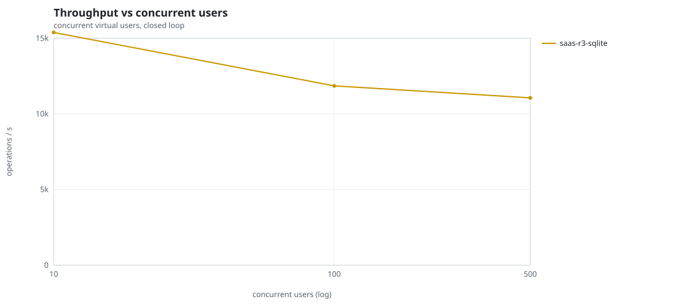
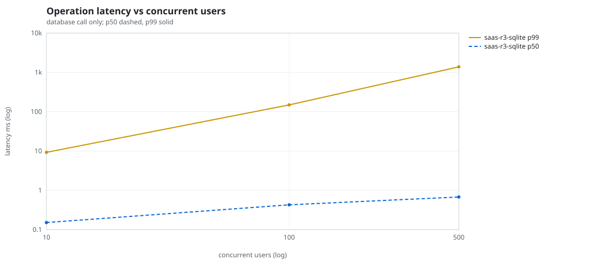
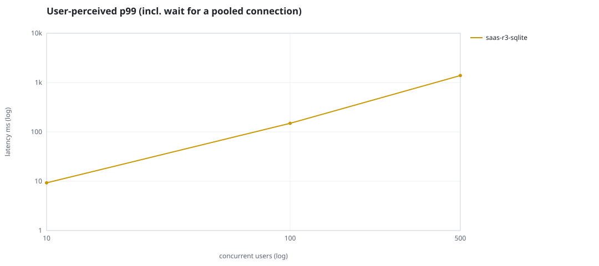
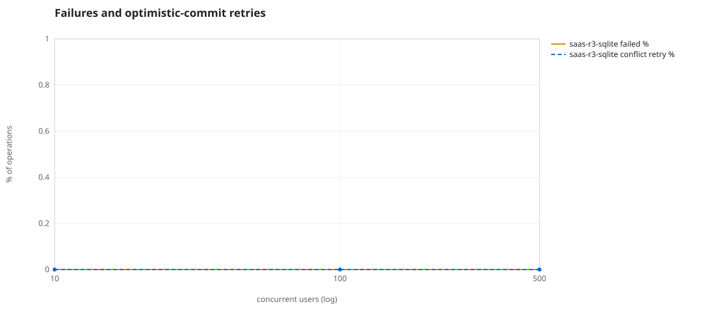
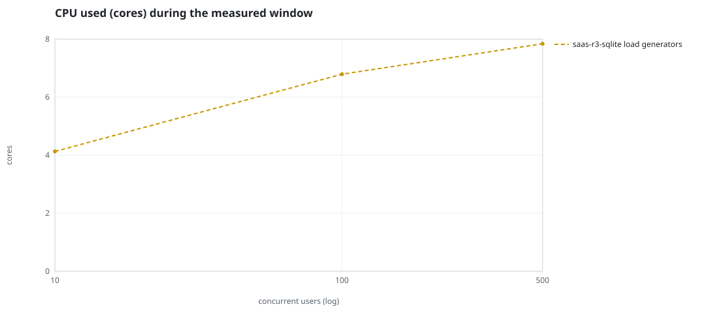
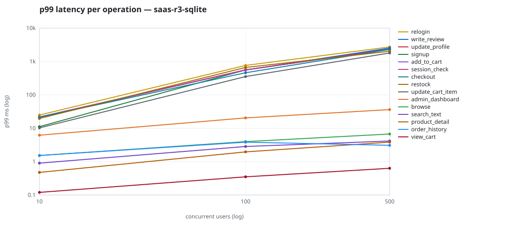

# Mini-SaaS concurrency simulation — sqlite

Run: `saas-r3-sqlite` on 2026-09-26T05:43:52 · commit `5ff1190` · macOS-26.6.2-arm64-arm-64bit-Mach-O · 10 CPUs

## Configuration

- **transport**: sqlite
- **levels**: [10, 100, 500]
- **duration**: 30.0
- **warmup**: 5.0
- **ramp**: 5.0
- **think**: [0.0, 0.0]
- **processes**: 10
- **connections**: 0
- **durability**: balanced
- **products**: 5000
- **accounts**: 20000
- **scenario**: baseline
- **seed**: 3
- **fresh_per_stage**: False
- **seed time**: 0.11 s, 4.6 MiB after seeding

## Capacity and performance curve

Latencies are of the database call (service operation) in milliseconds; `user p99` adds the wait for a pooled connection.

| users | conns | ops/s | reads/s | writes/s | p50 | p95 | p99 | p99.9 | max | user p99 | success % | conflict retry % | srv CPU | srv RSS MiB | gen CPU | thr CV | invariants |
|---:|---:|---:|---:|---:|---:|---:|---:|---:|---:|---:|---:|---:|---:|---:|---:|---:|---:|
| 10 | 10 | 15385.0 | 11615.0 | 3770.0 | 0.152 | 1.516 | 9.289 | 41.629 | 463.344 | 9.289 | 100.0 | 0.0 | None | None | 4.13 | 0.074 | ok |
| 100 | 100 | 11852.9 | 8942.2 | 2910.6 | 0.429 | 10.258 | 149.458 | 1176.059 | 3663.587 | 149.459 | 100.0 | 0.0 | None | None | 6.79 | 0.037 | ok |
| 500 | 500 | 11058.8 | 8357.5 | 2701.3 | 0.678 | 91.854 | 1387.284 | 3545.104 | 9934.749 | 1387.284 | 100.0 | 0.0 | None | None | 7.84 | 0.027 | ok |

## Insights

- **Peak throughput**: 15385.0 ops/s at 10 users (p99 9.289 ms).
- **Capacity at p99 ≤ 10 ms**: 10 users (DB latency); 10 users counting pool wait.
- **Capacity at p99 ≤ 50 ms**: 10 users (DB latency); 10 users counting pool wait.
- **Capacity at p99 ≤ 100 ms**: 10 users (DB latency); 10 users counting pool wait.
- **Capacity at p99 ≤ 250 ms**: 100 users (DB latency); 100 users counting pool wait.
- **Capacity at p99 ≤ 1000 ms**: 100 users (DB latency); 100 users counting pool wait.
- **USL fit**: σ (contention) = 0.28, κ (coherency) = 3.16e-04, predicted peak at N ≈ 47.7 (rmse log 0.154).
- **Generator CPU includes the database**: SQLite runs inside the load-generator processes, so `gen CPU` is application plus engine and there is no server column.
- **Read-your-writes violations**: none.
- **Business invariants**: all stages ok.
- **Offline integrity check** (PRAGMA integrity_check): ok in 0.09 s.
- **Database size**: 11.2 MiB after the first stage, 21.4 MiB after the last; 49284 paid orders in total.

## p99 latency per operation (ms)

| op | share % | 10 | 100 | 500 |
|---|---:|---:|---:|---:|
| add_to_cart | 11.0 | 21.36 | 555.74 | 2316.61 |
| admin_dashboard | 1.07 | 6.19 | 20.41 | 36.18 |
| browse | 21.94 | 1.53 | 3.98 | 6.72 |
| checkout | 4.41 | 21.46 | 460.50 | 2300.38 |
| order_history | 3.28 | 1.53 | 3.83 | 3.08 |
| product_detail | 18.59 | 0.48 | 1.96 | 3.84 |
| relogin | 1.63 | 24.91 | 763.65 | 2721.17 |
| restock | 0.33 | 19.64 | 663.10 | 2027.31 |
| search_text | 8.68 | 0.90 | 2.84 | 4.15 |
| session_check | 13.15 | 21.33 | 562.15 | 2311.28 |
| signup | 0.54 | 11.17 | 558.03 | 2354.82 |
| update_cart_item | 3.29 | 10.27 | 353.96 | 1802.52 |
| update_profile | 1.1 | 21.18 | 560.59 | 2357.96 |
| view_cart | 8.78 | 0.12 | 0.35 | 0.63 |
| write_review | 2.21 | 21.79 | 557.70 | 2529.15 |

## Errors and business outcomes at the highest level

```json
{
 "statuses": {
  "ok": 327061,
  "empty_cart": 4340,
  "out_of_stock": 340,
  "not_found": 23
 },
 "errors": {}
}
```

## Charts








