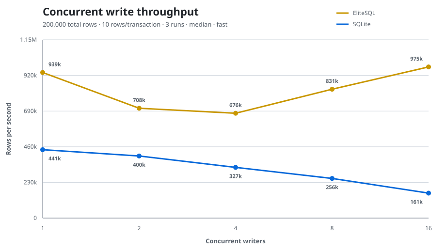
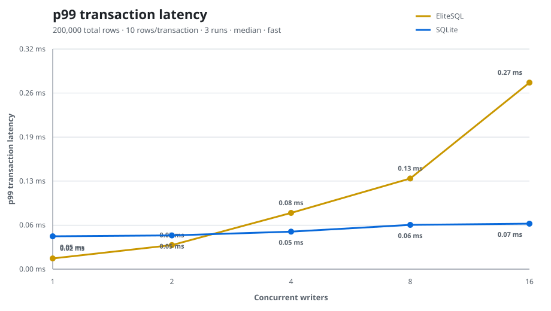
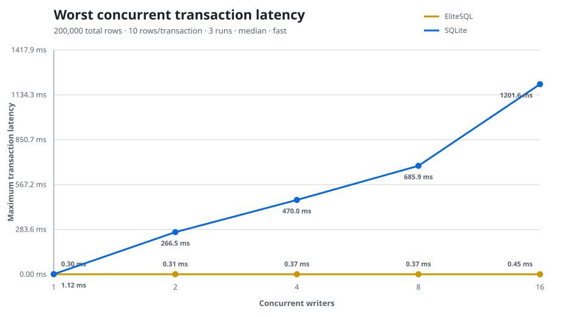

# EliteSQL current benchmarks

This document publishes the measurements collected on 2026-08-08 after the
bounded-memory, paged/mmap index, typed SQL parameter, and primary immutable-run
changes. Earlier results are retained only as a labeled before/after baseline;
they describe a materially different checkpoint algorithm.

The results are candid. The primary directory publishes immutable deltas and
promotes groups of sixteen same-level runs in the background; equality and
BM25 retain fanout eight. Non-overlapping V2 primary runs are promoted by
copying already checksummed pages without decoding and rebuilding every entry.
The current implementation also has a direct sorted bulk loader, streaming
unindexed equality scans, compact mmap page directories, transaction-local
table interning and allocation-light checkpoint snapshots. On the reference
10M workload EliteSQL stayed within 2x SQLite with the then-current lightweight
default and within 1.5x with the former opt-in ingest profile. It beat SQLite
for sorted bulk load, point lookup and the measured unindexed equality scan.

Post-reference architectural change (2026-08-08): primary-only automatic
checkpoints now freeze one bounded memtable generation and flush it on a
dedicated worker while later commits fill a fresh active generation. The
frozen heap is charged to the maintenance pool, and manifest publication
rotates only the complete WAL tail written after the freeze. Explicit
checkpoint remains the end-to-end barrier used by this benchmark. A 1M-row
release sanity run (`fast`, 10K rows/transaction, former 128 MiB default)
measured 1.980 s ingest + 0.051 s final checkpoint = 2.031 s total, versus the
prior 2.044 s local result. That small 0.6% change is directional, not a
replacement for the published 10M acceptance matrix; it shows the
implementation was close to flush-throughput-bound at this scale.

## Reference environment and source state

- MacBook Air, Apple M5, 10 cores (4 performance + 6 efficiency)
- 16 GiB RAM
- macOS 26.5.2 (25F84), arm64
- Rust/Cargo 1.93.1, release benchmark profile
- SQLite 3.45.0 through `rusqlite`'s bundled build
- EliteSQL 0.0.1 worktree on top of commit `001e791`

The worktree contains the changes being measured; the commit hash alone is not
sufficient to reproduce these numbers until those changes are committed.
Benchmarks ran sequentially on the same machine. No benchmark ran in parallel
with another measurement.

## How to read memory numbers

The published 10M measurements used the former 128 MiB logical envelope:
64 MiB for concurrent queries, 16 MiB admitted per query, 24 MiB for mutable
index deltas, 32 MiB for maintenance, and an 8 MiB reserve. The current default
is the 384/128/128 MiB profile measured in the vector restart section below.
Clean file-backed `mmap` pages and values already returned to the caller are
deliberately outside that accounting.

Consequently, the configured envelope is not an RSS ceiling. macOS
`/usr/bin/time -l` reports both maximum resident set size and peak physical
footprint for the complete benchmark process. Mapped clean pages are
reclaimable, but they can still become resident and appear in RSS after scans
or full-base merges. Tables below keep logical admission and observed process
memory conceptually separate.

## Scalable load and reads: EliteSQL versus SQLite

The harness is
[`scale_vs_sqlite.rs`](crates/elitesql-core/benches/scale_vs_sqlite.rs). Both
engines receive deterministic rows with an explicit text primary key, two text
columns, and one signed 64-bit score. Rows are committed in 10K-row
transactions. EliteSQL automatic compaction and SQLite automatic WAL
checkpointing are disabled so hidden maintenance cannot move into the measured
write window.

Durability mappings are:

| Option | EliteSQL | SQLite |
|---|---|---|
| `fast` | `Durability::Fast` | WAL + `synchronous=OFF` |
| `balanced` | `Durability::Balanced` | WAL + `synchronous=NORMAL` |
| `safe` | `Durability::Safe` | WAL + `synchronous=FULL` |

The published scale runs use `fast`; smoke runs also passed under `balanced`
and `safe`. Schema creation is outside timing. `ingest wall` includes staging,
commit and automatic checkpoints. `final checkpoint` and the wait for queued
run promotions (`maintenance drain`) are reported separately; `total load`
includes all three. Point reads follow 1,000 warmups. The full scan is the
average of three unindexed equality lookups that each return one row.

### 10M rows: optimized former-default transactional path

Configuration: 10K rows/transaction, 10K point reads, three full scans and the
former 128 MiB EliteSQL envelope.

| Engine | Ingest wall | Final checkpoint | Drain | Total load | Rows/s | Point read | Full scan | Disk |
|---|---:|---:|---:|---:|---:|---:|---:|---:|
| EliteSQL | 21.525 s | 0.086 s | 1.009 s | 22.620 s | 442,096 | 11.969 µs | 0.793 s | 2248.86 MiB |
| SQLite | 11.370 s | 2.293 s | 0 s | 13.663 s | 731,916 | 69.058 µs | 1.126 s | 1520.11 MiB |

EliteSQL takes 1.66x SQLite's end-to-end load time, inside the 2x target. Its
point lookup is 5.77x faster and its measured scan is 1.42x faster. Relative
to the previous 25.984 s EliteSQL result, total load improved 13.0% and ingest
wall improved 8.3%. EliteSQL wrote 533.30 MiB of primary checkpoint runs; seven
promotions read 477.84 MiB and wrote 477.83 MiB. The previous fanout-eight run
performed 16 promotions and read/wrote 785 MiB in each direction.

### 10M rows: former 256 MiB ingest profile

At measurement time, `DbOptions::ingest_performance()` kept query admission at
64 MiB and raised the mutable-index and maintenance pools to 64 MiB each and
the memtable target to 64 MiB. The current preset is larger; this table remains
the reproducible historical result for that exact former configuration.

| Engine | Ingest wall | Final checkpoint | Drain | Total load | Rows/s | Point read | Full scan | Disk |
|---|---:|---:|---:|---:|---:|---:|---:|---:|
| EliteSQL ingest profile | 17.828 s | 0.091 s | 0.879 s | 18.798 s | 531,982 | 21.969 µs | 0.827 s | 2248.85 MiB |
| SQLite | 11.370 s | 2.293 s | 0 s | 13.663 s | 731,916 | 69.058 µs | 1.126 s | 1520.11 MiB |

The opt-in profile takes 1.38x SQLite's total load time, meeting the 1.5x
stretch target without making the default heavier. All logical peaks remained
inside their configured pools: query 16/64 MiB, delta 62.73/64 MiB and
maintenance 64/64 MiB. It required 46 consolidations and two promotions,
versus 125 consolidations and seven promotions at the default.

### 10M rows: direct sorted bulk path

`Db::bulk_insert_sorted` accepts strictly increasing explicit IDs and requires
derived indexes to be created after loading. It streams one canonical segment
and one primary run with bounded memory.

| Engine | Total load | Rows/s | Point read | Full scan | Disk |
|---|---:|---:|---:|---:|---:|
| EliteSQL sorted bulk | 9.968 s | 1,003,181 | 12.584 µs | 0.692 s | 2248.84 MiB |
| SQLite transactions | 13.822 s | 723,498 | 64.928 µs | 1.085 s | 1520.11 MiB |

EliteSQL is 1.39x faster end-to-end in this import workload, 5.16x faster on
the subsequent point reads and 1.57x faster on the scan.

### Isolated 10M memory measurement

`/usr/bin/time -l` ran EliteSQL alone with the transactional workload:

| Logical envelope | Query peak | Delta peak | Maintenance peak | Max RSS | Peak physical footprint |
|---:|---:|---:|---:|---:|---:|
| 128 MiB | 16.00 / 64 MiB | 22.81 / 24 MiB | 32.00 / 32 MiB | 879.47 MiB | 65.56 MiB |

The high RSS is mostly clean file-backed pages touched through `mmap`; macOS
can reclaim them and does not count them as dirty physical footprint. The
65.56 MiB footprint is the more useful process-level corroboration of the
logical governor. Checkpoint snapshots intern table names and store IDs in one
contiguous buffer, avoiding the allocator retention that previously pushed
physical footprint above 350 MiB.

The latest structured results are in
[`benchmark-results/scale-optimized-2026-08-08.csv`](benchmark-results/scale-optimized-2026-08-08.csv).
The preceding 25.984 s checkpoint/LSM baseline remains in
[`benchmark-results/scale-current-2026-08-08.csv`](benchmark-results/scale-current-2026-08-08.csv),
and the older superlinear and first-LSM measurements remain in
[`benchmark-results/scale-2026-08-08.csv`](benchmark-results/scale-2026-08-08.csv)
as historical baselines, not current performance claims.

### Small transaction and primary-key microbenchmark

The independent Criterion comparison in
[`vs_sqlite.rs`](crates/elitesql-core/benches/vs_sqlite.rs) uses 1,000-row
inserts and prepared primary-key reads. The central estimates from the current
run were:

| Operation | EliteSQL | SQLite | Result |
|---|---:|---:|---:|
| 1,000 inserts, one transaction | 1.948 ms | 1.192 ms | EliteSQL 1.63x SQLite time |
| 1,000 inserts, autocommit | 6.000 ms | 16.295 ms | EliteSQL 2.72x faster |
| Primary-key read | 0.705 us | 2.730 us | EliteSQL 3.87x faster |

The matched single-transaction case is the conservative traditional-write
comparison and remains inside the 2x acceptance boundary. Autocommit semantics
and durability costs differ enough between engines that its favorable result
is supporting evidence, not the primary acceptance measurement. Criterion
found no statistically significant change in either EliteSQL insert case after
the transaction-staging rewrite; the large-batch improvement did not introduce
a confirmed small-transaction regression.

## SQL query and bound-parameter overhead

The Criterion harness
[`sql.rs`](crates/elitesql-core/benches/sql.rs) builds 10K users and 1M orders.
It now compares interpolated benchmark literals with the equivalent safe
`query_params` calls over the same indexed plans.

| Query | Literal SQL | Bound values | Difference |
|---|---:|---:|---:|
| Unique-index point lookup | 4.050 µs | 4.019 µs | -0.8% |
| Indexed join, ~100 matching orders, top 10 | 250.00 µs | 230.68 µs | -7.7% |
| Unindexed 1M-row filter, `LIMIT 5` | 264.03 ms | — | — |

The confidence intervals overlap for the join and the point difference is
sub-microsecond. This run found no measurable parameter-binding penalty. The
bound path should be chosen for type preservation and injection safety; the
apparent speedup is not claimed as an optimization.

This SQL run predates the primary LSM. Its query intervals remain useful, but
the 244.83 s end-to-end preparation time must not be quoted as current load
performance. The table reports Criterion's measured query intervals only.

## Concurrent writers

The harness is
[`concurrent_writers.rs`](crates/elitesql-core/benches/concurrent_writers.rs).
Each point uses 200K total rows, 10 rows/transaction, disjoint IDs, three fresh
runs, and the median. Checkpoints are outside the measured write window. The
EliteSQL harness gives the bounded delta 384 bytes per fixture row and asserts
that no consolidation occurred before timing ended; SQLite likewise disables
automatic WAL checkpoints. This isolates commit concurrency rather than
silently charging maintenance to only one engine.

| Writers | EliteSQL rows/s | SQLite rows/s | EliteSQL / SQLite |
|---:|---:|---:|---:|
| 1 | 491,420 | 230,633 | 2.131× |
| 2 | 404,311 | 221,590 | 1.825× |
| 4 | 384,854 | 193,139 | 1.993× |
| 8 | 376,398 | 153,122 | 2.458× |

| Writers | Engine | p50 | p95 | p99 | Maximum |
|---:|---|---:|---:|---:|---:|
| 1 | EliteSQL | 19.2 µs | 24.3 µs | 30.1 µs | 0.56 ms |
| 1 | SQLite | 30.4 µs | 76.0 µs | 98.0 µs | 1.53 ms |
| 2 | EliteSQL | 48.3 µs | 54.3 µs | 81.3 µs | 0.52 ms |
| 2 | SQLite | 31.0 µs | 75.8 µs | 99.4 µs | 469.08 ms |
| 4 | EliteSQL | 102.7 µs | 111.9 µs | 144.0 µs | 0.49 ms |
| 4 | SQLite | 43.7 µs | 77.6 µs | 96.3 µs | 782.27 ms |
| 8 | EliteSQL | 210.0 µs | 223.7 µs | 260.9 µs | 0.91 ms |
| 8 | SQLite | 49.5 µs | 77.3 µs | 97.7 µs | 1193.64 ms |

EliteSQL wins median throughput at every writer count by 1.82x–2.46x. It also
keeps the median worst transaction below 1 ms, while SQLite's serialized lock
wait reaches 469–1194 ms with 2–8 writers. EliteSQL's p99 is better at one and
two writers but remains 1.50x and 2.67x higher at four and eight writers; that
normal-tail latency is the main remaining concurrency target.

Raw repetitions are in
[`benchmark-results/concurrent-writers-2026-08-08.csv`](benchmark-results/concurrent-writers-2026-08-08.csv).
The charts were regenerated from that CSV:







## Synthetic ANN: 100K vectors

The Criterion harness [`vector.rs`](crates/elitesql-core/benches/vector.rs)
uses 100K deterministic clustered vectors of dimension 64 and compares HNSW
against brute-force top-10 ground truth over 50 queries.

| `ef_search` | Recall@10 | Mean search interval |
|---:|---:|---:|
| 64 | 0.9320 | 1.235 ms |
| 128 | 0.9940 | 1.998 ms |
| 256 | 1.0000 | 3.368 ms |
| 512 | 1.0000 | 5.553 ms |

Opening the persisted graph in this harness took 15.618 s. Maximum process RSS
was 376.25 MiB. This RSS includes the benchmark's retained vectors for exact
ground truth and is not an engine-only memory measurement.

Recall improved relative to the old publication, but latency regressed by
roughly 4–5×. The mmap-native search path needs profiling for random page
faults, repeated node decoding, allocations, and missing scratch-buffer reuse.

### Memory sizing on AWS t3.large

A focused restart harness in
[`vector_memory.rs`](crates/elitesql-core/examples/vector_memory.rs) measured the
same 100K-vector, 64-dimensional workload on an AWS `t3.large` (2 vCPU, 8 GiB
RAM). It reports how many nodes reach the durable HNSW base before close and how
many must be reconstructed during the next open.

| Total | Index delta | Maintenance | Memtable | Durable nodes | Catch-up rows | Open | Max RSS |
|---:|---:|---:|---:|---:|---:|---:|---:|
| 128 MiB | 24 MiB | 32 MiB | 16 MiB | 20,000 | 80,000 | 101.503 s | 93 MiB |
| 256 MiB | 64 MiB | 64 MiB | 64 MiB | 50,000 | 50,000 | 57.639 s | 144 MiB |
| 304 MiB | 109 MiB | 109 MiB | 64 MiB | 90,000 | 10,000 | 6.385 s | 198 MiB |
| 304 MiB | 110 MiB | 110 MiB | 64 MiB | 100,000 | 0 | 0.356 s | 196 MiB |
| 320 MiB | 112 MiB | 112 MiB | 64 MiB | 100,000 | 0 | 0.347 s | 196 MiB |
| 384 MiB | 128 MiB | 128 MiB | 64 MiB | 100,000 | 0 | 0.536 s | 196 MiB |

The measured index-delta peak was 115,000,000 bytes (109.67 MiB), explaining
the sharp boundary between 109 and 110 MiB. The exact 110 MiB minimum has less
than 0.4 MiB of headroom, so the profile selected as the default on 2026-08-09
is 384 MiB total, 128 MiB each for index delta and maintenance, and a 64 MiB
memtable. It retains the complete 100K graph while using only about 196 MiB of
observed process RSS. Re-run the harness when vector count, dimension, HNSW
parameters, ID sizes or indexed metadata change.

```bash
cargo run --release --locked -p elitesql-core --example vector_memory -- \
  --rows 100000 --total-mib 384 --index-mib 128 \
  --maintenance-mib 128 --memtable-mib 64
```

## Real multilingual ANN: Potion + MIRACL-es, 250K

The reproducible example is
[`examples/vector_search_potion/miracl_search.py`](examples/vector_search_potion/miracl_search.py).
It uses `minishlab/potion-multilingual-128M` through Model2Vec, 256-dimensional
normalized embeddings, 648 Spanish queries, and 250K real MIRACL-es passages.
Model and dataset revisions are pinned in the script.

### Build memory boundary

With the former default 128 MiB total / 32 MiB maintenance configuration,
insertion completed but HNSW construction was rejected with
`Error::MemoryLimit`. This was the intended safe failure mode. The current
384/128 MiB default has not yet been acceptance-tested on this 250K workload.

The successful build used an explicit 640 MiB total envelope and 512 MiB
maintenance pool:

```bash
python3 examples/vector_search_potion/miracl_search.py \
  --corpus-size 250000 \
  --db target/potion-miracl-es-250k.esql \
  --total-memory-mib 640 \
  --maintenance-memory-mib 512 \
  --ef-search 128 \
  --rebuild \
  --output-json benchmark-results/potion-miracl-es-250k.json
```

| Phase | Time |
|---|---:|
| Embed 250K passages | 11.649 s |
| Insert into EliteSQL | 55.895 s |
| Build and persist HNSW V4 | 230.762 s |
| Complete process | 305.760 s |

The resulting database is 690.12 MiB, including a 283 MiB HNSW file. The
end-to-end Python process peaked at 2.16 GiB RSS; it retains the model,
250K-vector NumPy matrix, exact-search state, canonical records, and mutable
HNSW builder, so this is not an engine-only heap number.

A separate read-only Python process opened the persisted 250K database in
0.454 s and executed one cold `ef=128` search in 3.973 ms. It peaked at
376.66 MiB RSS and 65.88 MiB physical footprint; most of the RSS is mapped file
content touched during open/search.

### Search quality and latency on the same persisted index

Each row below is a fresh process reopening the same index. Search latency
excludes query embedding generation.

| `ef_search` | ANN recall@10 | Mean | p50 | p95 | p99 | Global Hit@10 |
|---:|---:|---:|---:|---:|---:|---:|
| 128 | 0.9630 | 1.341 ms | 1.324 ms | 1.598 ms | 1.893 ms | 0.5710 |
| 256 | 0.9789 | 1.721 ms | 1.709 ms | 2.106 ms | 2.423 ms | 0.5895 |
| 512 | 0.9880 | 2.486 ms | 2.440 ms | 3.173 ms | 3.463 ms | 0.5957 |

Exact global search obtains `Hit@10=0.5972`. `ef=256` remains a strong
quality/latency point, while `ef=512` nearly removes ANN loss. The reranking
subset remains perfect at `Hit@10=1.0`; MIRACL's reranking judgments are not an
exhaustive relevance labeling of the 250K global corpus.

Structured results:

- [`ef=128 build`](benchmark-results/potion-miracl-es-250k.json)
- [`ef=128 reopened`](benchmark-results/potion-miracl-es-250k-ef128.json)
- [`ef=256`](benchmark-results/potion-miracl-es-250k-ef256.json)
- [`ef=512`](benchmark-results/potion-miracl-es-250k-ef512.json)

## Performance work implied by these results

Immutable runs resolved the original superlinear checkpoint defect. The direct
bulk loader, single-pass unindexed scan, compact page-directory format,
transaction-local table interning, direct checkpoint run generation and raw
disjoint-page promotion close the measured SQL and physical memory gaps.
Remaining work is narrower:

1. **Implemented for primary-only automatic checkpoints.** Repeat the full 10M
   matrix and profile why the 1M end-to-end gain is only 0.6%; checkpoint work
   remains included through the explicit final barrier, not hidden in drain.
2. Improve p99 commit latency with four to eight writers while preserving the
   current 1.82x–2.46x throughput and sub-millisecond worst-tail advantage.
3. Extend primary/equality/BM25 byte/time counters to vector, segment and fsync
   work, and add a dedicated derived-index throughput benchmark.
4. Make large HNSW construction more incremental: the 250K Potion build safely
   rejects the default maintenance pool and currently needs an explicit larger
   profile, although persisted search itself is mmap-backed and efficient.
5. Repeat the acceptance matrix on additional hardware, durability modes,
   mixed updates/deletes and cold caches; one favorable machine is evidence,
   not a universal performance guarantee.

Every follow-up must preserve the bounded-memory and crash-recovery contracts.

## Reproducing

```bash
# Transactional scale and isolated-engine memory
cargo bench -p elitesql-core --bench scale_vs_sqlite -- \
  --rows 10m --durability fast --batch-size 10k \
  --point-reads 10k --full-scans 3

# Direct sorted bulk load
cargo bench -p elitesql-core --bench scale_vs_sqlite -- \
  --rows 10m --durability fast --bulk-sorted \
  --point-reads 10k --full-scans 3

/usr/bin/time -l target/release/deps/scale_vs_sqlite-<hash> \
  --rows 10m --durability fast --batch-size 10k \
  --point-reads 1k --full-scans 1 --engine elitesql

# SQL, including bound parameters
cargo bench -p elitesql-core --bench sql

# Concurrent writers and charts
cargo bench -p elitesql-core --bench concurrent_writers -- \
  --rows 200k --batch-size 10 --repetitions 3 --durability fast \
  --csv benchmark-results/concurrent-writers-2026-08-08.csv
python3 scripts/plot-concurrent-benchmark.py \
  benchmark-results/concurrent-writers-2026-08-08.csv \
  --output-dir benchmark-results

# Synthetic ANN
cargo bench -p elitesql-core --bench vector
```

For the exact executable path used by `/usr/bin/time`, first run
`cargo bench -p elitesql-core --bench scale_vs_sqlite --no-run`. Re-run on the
target hardware before making capacity decisions; these values describe one
machine and one current worktree, not universal guarantees.
